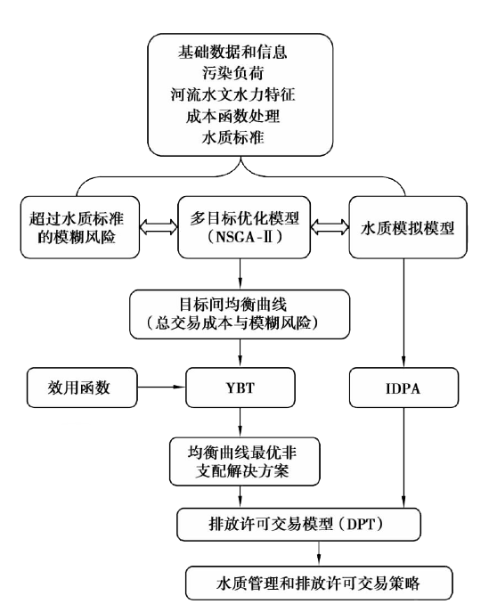
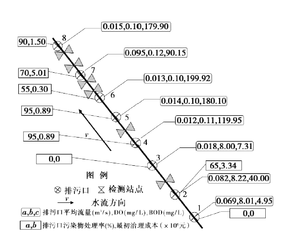
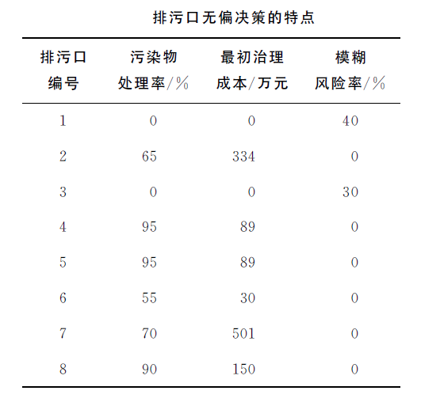
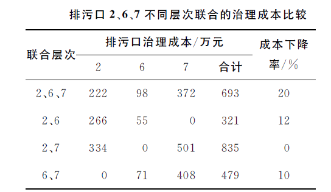
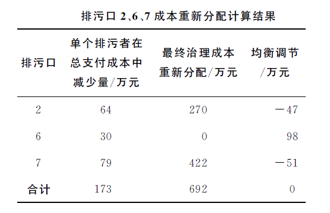

# 数理经济学
### 基于均衡理念的流域污染物排放许可交易

<small> Created by [Chiffon](http://chiffon.gitcafe.io) 13720064 郎大为</small>

*** =pnotes

中国水利水电科学研究院流域水循环模拟与调控国家重点实验室
2012 重庆学报

---
## OUTLINES

- 背景介绍
- 选用的模型
  - 遗传算法改进序列(NSGA-II)
  - Young交易理论(YBT)
  - 污染物初始排放许可分配(IDPA)模型
  - 排放许可交易DPT模型
- 案例分析

*** =pnotes

污染物排放许可交易是一种实现流域污染物治理与水质改善均衡发展的有效经济手段。

在概述国内外流域污染物排放交易研究特点的基础上，给出以治污成本最小化、低水位水质风险最小化为目标函数的污染物排放交易研究框架。

--- &vertical ds:soothe

## 背景介绍

***
### 排污许可证

1. 排污许可证商品化
2. 厂商根据自身排污情况购买许可证
3. 通过市场调节

*** =pnotes
1、可交易排污许可证，也叫做排污许可证交易，是把排污许可证商品化，是国家一项重要的环境经济政策。
2、厂商根据自身排污情况购买许可证。当然随着排污量的增多，可能会出现购买多个的问
题。也有的是厂商自己用不了这么多，也可以当做商品交易。当然前提是保证自己的排污需要。购买多个，可以像正常的商品一样，进行增价来营利。政府在一段时间内为控制排污总量，发放的许可证是定量的，也就意味着许可证要想商品一样流通。
3、这项政策把排污许可商品化，通过市场这支看不见的受来调控，以实现对环境容量资源的合理利用。政府可以通过发放或收购许可证，调节一个区域污染物排放总量，必要时可以通过发放或收购许可证调节许可证的交易价格。

***
### 研究背景

- 污染物排放许可交易制度首先由Crocker[3]和Dales[4]提出
- 大部分研究是基于:
  - 经济学原理层面
  - 实例研究
  - 确定性研究

*** =pnotes
容易忽略环境的随机性影响

***
### 研究背景
- 污染物排放的风险
- 治污成本变动

*** =pnotes
不同位置污染物排放的风险(自然保护区)
不同位置治理的成本不同

***
### 目标函数
- 治污成本最小化
- 低水位水质风险最小化

--- &vertical ds:soothe
### 研究方法

***
###  遗传算法改进序列(NSGA-II)
 
NSGA-II是目前最流行的多目标优化算法之一，它降低了非劣排序遗传算法的复杂性，具有运行速度快，解集的收敛性好的优点，成为其他多目标优化算法性能的基准。

***
###  遗传算法改进序列(NSGA-II)
 

   $$ \begin{align} \min &\left(f_1(x), f_2(x),\ldots, f_k(x) \right) \\ \text{s.t. } &x\in X, \end{align}$$

***
###  遗传算法改进序列(NSGA-II)
 

$x^1\in X$ 比 $x^2\in X$ 是一个更优解(Pareto optimal solutions)

- $f_i(x^1)\leq f_i(x^2)$ for all indices $i \in \left\{ {1,2,\dots,k } \right\}$
- $f_j(x^1) < f_j(x^2)$ for at least one index $j \in \left\{ {1,2,\dots,k } \right\}$.

***
### Young交易理论(YBT)

- Young Bargaining Theory
- 提供了一种调查双方价格满足程度的方法
- 模型假定存在2种有限性:
  - 可能的交易数目$l_1$
  - 代理商数量$l_2$
- 在每个周期中，2个随机给定代理商的 $j \in l_1,k \in l_2$ 开始有2个参与者1和2独自进行博弈。

***
### Young交易理论(YBT)
- 在用NSGA-II方法获得均衡曲线的基础上
- YBT模型用于选择无偏差的最优解决方案。
- 排放者 $i$ 的污染物处理水平 $x'$ 和排放负荷 $p_i$

*** =pnotes
解决方案中包括上下游可接受的总治
理成本以及超标水质造成的风险，也包括污染物排
放者ｉ的污染物处理水平（ｘ′）和排放负荷（ｐｉ）。

***
### 污染物初始排放许可分配(IDPA)模型
- Initial Discharge Permit Allocation model
- 用于检测污染物的排放负荷
$$maxZ_1 = \sum_{i=1}^{n} \overline{p_i}$$
$$subject \quad to\quad  c_{al} \ge c_a$$

*** =pnotes
式中：ｐｉ为污染者ｉ的污染负荷，ｋｇ；
ｎ为总排污者的个数；
ｃａｌ为水质指标污染物ａ（如ＣＯＤ）在检测站点ｌ
处的体积浓度，ｍｇ／Ｌ；
ｃａ为水质指标污染物ａ 的最小允许检测体积浓度，ｍｇ／Ｌ。

***
### 排放许可交易DPT模型

- NGGA-II,YBT对排污者i提供了:
  - 污染物的最优处理水平
  -  污染物的最优限定排放负荷$p_i$，
- IPDA提供了最大污染物排放负荷$\overline{p_i}$

***
### 排放许可交易DPT模型
 
- $\overline{p_i} < p_i$
- $\overline{p_j} > p_j$

---

--- ds:soothe
## 案例分析  

---
### 监测指标
 
- DO
  - 环境监测氧参数(dissolved oxygen;DO)空气中的分子态氧溶解在水中称为溶解氧。
- BOD
  - 生化需氧量(Biochemical Oxygen Demand)或生化耗氧量(五日化学需氧量),表示水中有机物等需氧污染物质含量的一个综合指示

---

---

---

---

