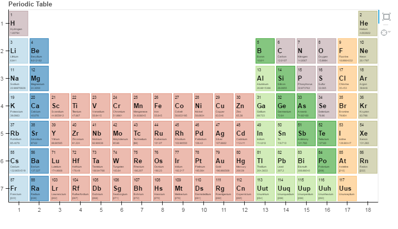

```{r setup, include=FALSE,echo = F, message = F, warning = F, tidy = F, cache=F}
library(knitr)
# make this an external chunk that can be included in any file
options(width = 100,digits=4)
opts_chunk$set(message = FALSE, fig.align = "center", warning = FALSE, comment = NA, dpi = 100, tidy = FALSE, fig.width=8,fig.height=5,cache = FALSE)

knit_hooks$set(plot = knitr:::hook_plot_html)

```

<style>
td{
font-size: 3
}
.title-slide {
  background-color: #e2e2e2;
}

.title-slide hgroup > h1{
  font-family: 'Oswald', '微软雅黑';
  color: #202020;
  letter-spacing: 2px;
}

.title-slide hgroup > h2{
  font-family: 'Signika Negative', 'Calibri', '微软雅黑';
  color: #202020;
  letter-spacing: 2px;
}

.reveal {font-family: 'Signika Negative', 'Calibri', '微软雅黑';
  color: #202020;
}

strong{
 color: #4876FF;
}

</style>

## 新瓶与新酒
### 让R的可视化更炫酷
<small> Created by [Chiffon](http://lchiffon.github.io)郎大为</small><br/>
<small>J.D. Power 数据分析师</small>
<script src="../libraries/jquery.min.js"></script>
<script>
			document.write( '<link rel="stylesheet" href="libraries/frameworks/revealjs/css/print/' + ( window.location.search.match( /print-pdf/gi ) ? 'pdf' : 'paper' ) + '.css" type="text/css" media="print">' );
		</script>

---
## 可视化是手段
```{r echo=F}
kable(head( data.frame(
  id = 1:10,
  name = c("Bob", "Ashley", "James", "David", "Jenny", 
    "Hans", "Leo", "John", "Emily", "Lee"), 
  age = c(28, 27, 30, 28, 29, 29, 27, 27, 31, 30),
  grade = c("C", "A", "A", "C", "B", "B", "B", "A", "C", "C"),
  test1 = c(8.9, 9.5, 9.6, 8.9, 9.1, 9.3, 9.3, 9.9, 8.5, 8.6),
  test2 = c(9.1, 9.1, 9.2, 9.1, 8.9, 8.5, 9.2, 9.3, 9.1, 8.8),
  final = c(9, 9.3, 9.4, 9, 9, 8.9, 9.25, 9.6, 8.8, 8.7),
  registered = c(TRUE, FALSE, TRUE, FALSE, TRUE, TRUE, TRUE, FALSE, FALSE, FALSE),
  stringsAsFactors = FALSE)))
```

---&vertical
### 新的瓶子: HtmlWidgets
### *package:formatR*

<iframe data-src="./html/formattable.html" height="600px" width="800px"></iframe>

*** 
## Codes

```{r eval=F}
install.packages("formattable")
library(formattable)

df <- data.frame(
  id = 1:10,
  name = c("Bob", "Ashley", "James", "David", "Jenny", 
    "Hans", "Leo", "John", "Emily", "Lee"), 
  age = c(28, 27, 30, 28, 29, 29, 27, 27, 31, 30),
  grade = c("C", "A", "A", "C", "B", "B", "B", "A", "C", "C"),
  test1_score = c(8.9, 9.5, 9.6, 8.9, 9.1, 9.3, 9.3, 9.9, 8.5, 8.6),
  test2_score = c(9.1, 9.1, 9.2, 9.1, 8.9, 8.5, 9.2, 9.3, 9.1, 8.8),
  final_score = c(9, 9.3, 9.4, 9, 9, 8.9, 9.25, 9.6, 8.8, 8.7),
  registered = c(TRUE, FALSE, TRUE, FALSE, TRUE, TRUE, TRUE, FALSE, FALSE, FALSE),
  stringsAsFactors = FALSE)

formattable(df, list(
  age = color_tile("white", "orange"),
  grade = formatter("span", style = x ~ ifelse(x == "A", 
                                               style(color = "green", font.weight = "bold"), NA)),
  area(col = c(test1_score, test2_score)) ~ normalize_bar("pink", 0.2),
  final_score = formatter("span",
                          style = x ~ style(color = ifelse(rank(-x) <= 3, "green", "gray")),
                          x ~ sprintf("%.2f (rank: %02d)", x, rank(-x))),
  registered = formatter("span",
                         style = x ~ style(color = ifelse(x, "green", "red")),
                         x ~ icontext(ifelse(x, "ok", "remove"), ifelse(x, "Yes", "No")))
))

```

---&vertical
## 基础图形的局限

***
## 基础图形的局限
- 基础的图形已经能解决90%的问题
  - 饼图 一维世界
  - 条形图 二维世界
  - 散点、折线图 努力展示高维世界

***
## 如何在一张图中展示5个维度


***
```{r eval = F}
library(ggplot2)
ggplot(mpg,aes(cty, hwy, color=fl, size=displ)) +
  geom_point(position="jitter")+facet_wrap(~year)
```

---&vertical
## 值得展示的高维数据
- 不同污染物的情况
- 城市基本指标
- 运动员/候选人的数据

***
### 多维坐标轴*recharts::eParallel*

<iframe data-src="html/pall.html" height="600px" width="800px"></iframe>

*** 
## Codes
```{r eval=F}
devtools::install_github("taiyun/recharts")
library(recharts)
require(plyr)
axisList = list(
  list(index=7, type="category", data = c("low", "middle", "high")), 
  list(index=6, inverse=TRUE, max=50, nameLocation="start")
)
eParallel(head(parallelDf, 20), 
          series=~groupName,
          axisList = axisList)

```

---&vertical
### 雷达图 *radarchart::chartJSRadar*

- 数据科学家的战斗力

<iframe data-src="html/radar.html" height="600px" width="800px"></iframe>

***
### 雷达图*recharts::eRadar*

<iframe data-src="html/radar2.html" height="600px" width="800px"></iframe>

*** 
## Codes
```{r eval=F}
install.packages("radarchart")
library(radarchart)
labs <- c("Communicator", "Data Wangler", "Programmer",
          "Technologist",  "Modeller", "Visualizer")
scores <- list(
  "Rich" = c(9, 7, 4, 5, 3, 7),
  "Andy" = c(7, 6, 6, 2, 6, 9),
  "Aimee" = c(6, 5, 8, 4, 7, 6)
)
chartJSRadar(scores = scores, labs = labs, maxScale = 10)

library(recharts)
dat  <- data.frame(
  saleNum=c(scores[[1]],scores[[2]],scores[[3]]),
	names=c(rep("Rich",6), rep("Andy",6), rep("Aimee",6)),
  ability = labs
)

eRadar(dat, ~ability, ~saleNum, ~names,ymax=rep(12,6))
```

---&vertical
## 流程的转化

- App每天的用户都干什么了
- 为什么这次的活动没有带来收益
- 用户进入网站都干什么了

***
### 漏斗图 *recharts::eFunnel*
<iframe data-src="html/funnel.html" height="600px" width="800px"></iframe>

*** 
## Codes
```{r eval=F}
library(recharts)
x = c("Exposure" = 100, "Click" = 80, "Visit" = 60, "Query"=40, "Buy"=20)
eFunnel(x) 
funnelDf <- data.frame(namevar = c("Exposure", "Click", "Visit", "Query", "Buy"), 
   datavar = c(100, 80, 60, 40, 20), stringsAsFactors=FALSE)
eFunnel(funnelDf, ~namevar, ~datavar)
```

---&vertical
## 多维关系的展示


***
## *sunburstR::sunburst*
<iframe data-src="html/sun.html" height="600px" width="800px"></iframe>

*** 
## Codes
```{r eval=F}
library(TraMineR)
library(sunburstR)
library(pipeR)
# use example from TraMineR vignette
data("mvad")
mvad.alphab <- c(
  "employment", "FE", "HE", "joblessness",
  "school", "training"
)
mvad.seq <- seqdef(mvad, 17:86, xtstep = 6, alphabet = mvad.alphab)

# to make this work, we'll compress the sequences with seqdss
#   could also aggregate with dply later
seqtab( seqdss(mvad.seq), tlim = 0, format = "SPS" ) %>>%
  attr("freq") %>>%
  (
    data.frame(
      # appending "-end" is necessary for this to work
      sequence = paste0(
        gsub(
          x = names(.$Freq)
          , pattern = "(/[0-9]*)"
          , replacement = ""
          , perl = T
        )
        ,"-end"
      )
      ,freq = as.numeric(.$Freq)
      ,stringsAsFactors = FALSE
    )
  ) %>>%
  sunburst
```

---
## 关系的可视化
图数据的可视化
- igraph (旧瓶)
- ~~D3Network (破瓶)~~
- networkD3 (新瓶)
- diagrammeR

---&vertical
### 网络图*DiagrammeR*
<iframe data-src="html/graph.html" height="600px" width="800px"></iframe>

***
```{r eval=F}
library(DiagrammeR)
library(magrittr)

# Create a graph with fruit, vegetables,
# and nuts
nodes <-
  create_nodes(
    nodes = 1:9,
    type = c("fruit", "fruit", "fruit",
             "veg", "veg", "veg",
             "nut", "nut", "nut"),
    label = c("pineapple", "apple",
              "apricot", "cucumber",
              "celery", "endive",
              "hazelnut", "almond",
              "chestnut"))

edges <-
  create_edges(
    from = c(9, 3, 6, 2, 6, 2, 8, 2, 5, 5),
    to = c(1, 1, 4, 3, 7, 8, 1, 5, 3, 6))

graph <-
  create_graph(
    nodes_df = nodes,
    edges_df = edges,
    graph_attrs = "output = visNetwork")

# View the graph
render_graph(graph)
```

---&vertical
### 弦图


***
## Code
```{r eval=F}
library(networkD3)
hairColourData <- matrix(c(11975,  1951,  8010, 1013,
                           5871, 10048, 16145,  990,
                           8916,  2060,  8090,  940,
                           2868,  6171,  8045, 6907),
                         nrow = 4)

chordNetwork(Data = hairColourData, 
             width = 500, 
             height = 500,
             colourScale = c("#000000", 
                             "#FFDD89", 
                             "#957244", 
                             "#F26223"),
             labels = c("red", "brown", "blond", "gray"))
```

---&vertical
### 桑基图*networkD3::sankeyNetwork*
<iframe data-src="html/sankey.html" height="600px" width="800px"></iframe>

***
## Code
```{r eval = F}
library(networkD3)
# Load energy projection data
# Load energy projection data
URL <- paste0(
  "https://cdn.rawgit.com/christophergandrud/networkD3/",
  "master/JSONdata/energy.json")
Energy <- jsonlite::fromJSON(readLines(URL))
# Plot
sankeyNetwork(Links = Energy$links, Nodes = Energy$nodes, Source = "source",
              Target = "target", Value = "value", NodeID = "name",
              units = "TWh", fontSize = 12, nodeWidth = 30)

```

---&vertical
## 地理信息的可视化

***
### 美国大选


<small>http://blog.kaggle.com/2016/11/30/seventeen-ways-to-map-data-in-kaggle-kernels/</small>

***
### 中国GDP *REmap::remapC*
<iframe data-src="html/1GDP.html" height="600px" width="800px"></iframe>

***
### *leaflet*
<iframe data-src="html/R-birth.html" height="600px" width="800px"></iframe>

***
### 百度地图*REmap::remapB*
<iframe data-src="html/4bmap2.html" height="600px" width="800px"></iframe>

***
### 3D *threejs*
<iframe data-src="html/threejs.html" height="600px" width="800px"></iframe>

***
## Codes
```{r eval = F}
library(REmap)
GDP = read.csv("data/GDP.csv",encoding = "UTF-8")
remapC(GDP,
         color = c("red","yellow"),
         title = "2015年第二季度中国各省份GDP(亿元)",
         subtitle = "数据来源中国统计年鉴")

library(leaflet)
m <- leaflet() %>%
  addTiles() %>%  # Add default OpenStreetMap map tiles
  addMarkers(lng=174.768, lat=-36.852, popup="The birthplace of R")
m  # Print the map

library(threejs)

# Plot flights to frequent destinations from
# Callum Prentice's global flight data set,
# http://callumprentice.github.io/apps/flight_stream/index.html
data(flights)

# Approximate locations as factors
dest   <- factor(sprintf("%.2f:%.2f",flights[,3], flights[,4]))

# A table of destination frequencies
freq <- sort(table(dest), decreasing=TRUE)

# The most frequent destinations in these data, possibly hub airports?
frequent_destinations <- names(freq)[1:10]

# Subset the flight data by destination frequency
idx <- dest %in% frequent_destinations
frequent_flights <- flights[idx, ]

# Lat/long of frequent destinations
latlong <- unique(frequent_flights[,3:4])

# Plot frequent destinations as bars, and the flights to and from
# them as arcs. Adjust arc width and color by frequency.
earth <- system.file("images/world.jpg",  package="threejs")
globejs(img=earth, lat=latlong[,1], long=latlong[,2], arcs=frequent_flights,
        arcsHeight=0.3, arcsLwd=2, arcsColor="#ffff00", arcsOpacity=0.15,
        atmosphere=TRUE)
```

---&vertical
## 其他有意思的可视化

***
## 词云*wordcloud2*
<iframe data-src="html/R.html" height="600px" width="800px"></iframe>

***
## 时间轴*timevis*


***
## 热图*d3heatmap*
<iframe data-src="html/heatmap.html" height="600px" width="800px"></iframe>

***
## Codes
```{r eval=F}
library(wordcloud2)
# Sys.setlocale("LC_CTYPE","eng")
letterCloud(demoFreqC,"R",
            fontFamily='微软雅黑',
            backgroundColor='black',
            color='random-light')

library(timevis)
if (interactive()) {
  runExample()
}

library(d3heatmap)
d3heatmap(mtcars, scale = "column", colors = "Spectral")
```

---&vertical
## 前端可视化的框架
- plotly
  - Rstudio团队ggplot2原班人马
- rbokeh
  - python中bokeh的接口
- recharts
  - 百度echarts库
- rCharts，highchartsR
  - 基于其他JS库的可视化

***
### *plotly*


***
### *rbokeh*


***
### *rbokeh*


***
### *highcharts*


***
### *recharts*


***
## Code
```{r eval=F}
library(rbokeh)
# prepare data
elements <- subset(elements, !is.na(group))
elements$group <- as.character(elements$group)
elements$period <- as.character(elements$period)

# add colors for groups
metals <- c("alkali metal", "alkaline earth metal", "halogen",
  "metal", "metalloid", "noble gas", "nonmetal", "transition metal")
colors <- c("#a6cee3", "#1f78b4", "#fdbf6f", "#b2df8a", "#33a02c",
  "#bbbb88", "#baa2a6", "#e08e79")
elements$color <- colors[match(elements$metal, metals)]
elements$type <- elements$metal

# make coordinates for labels
elements$symx <- paste(elements$group, ":0.1", sep = "")
elements$numbery <- paste(elements$period, ":0.8", sep = "")
elements$massy <- paste(elements$period, ":0.15", sep = "")
elements$namey <- paste(elements$period, ":0.3", sep = "")

# create figure
p <- figure(title = "Periodic Table", tools = c("resize", "hover"),
  ylim = as.character(c(7:1)), xlim = as.character(1:18),
  xgrid = FALSE, ygrid = FALSE, xlab = "", ylab = "",
  height = 445, width = 800) %>%

# plot rectangles
ly_crect(group, period, data = elements, 0.9, 0.9,
  fill_color = color, line_color = color, fill_alpha = 0.6,
  hover = list(name, atomic.number, type, atomic.mass,
    electronic.configuration)) %>%

# add symbol text
ly_text(symx, period, text = symbol, data = elements,
  font_style = "bold", font_size = "10pt",
  align = "left", baseline = "middle") %>%

# add atomic number text
ly_text(symx, numbery, text = atomic.number, data = elements,
  font_size = "6pt", align = "left", baseline = "middle") %>%

# add name text
ly_text(symx, namey, text = name, data = elements,
  font_size = "4pt", align = "left", baseline = "middle") %>%

# add atomic mass text
ly_text(symx, massy, text = atomic.mass, data = elements,
  font_size = "4pt", align = "left", baseline = "middle")

p
```

---
## 一点建议
- 可视化不是炫技, 而是合理的展示数据
  - 合理展示的前提下再考虑更炫
- 奥卡姆剃刀： 如无必要, 勿增实例
  - 简洁而扁平的风格
- 不要让工具束缚你的想象力
  - Try JavaScript!

---
## Thanks

[My Blog: 七风阁](http://lchiffon.github.io)

<small>dawei_lang@sina.com|weibo:郎大为chiffon</small>
<br/>
<small>Wrote in Rstudio, power supported by revealjs, linked by slidify</small>
<script>
$('ul.incremental li').addClass('fragment')
</script>
