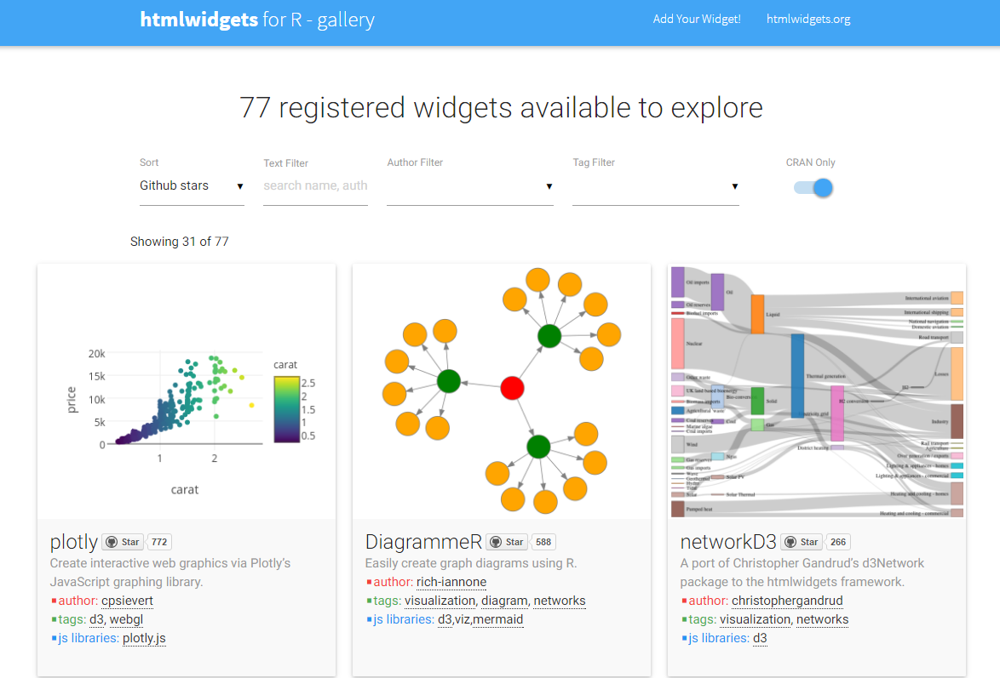
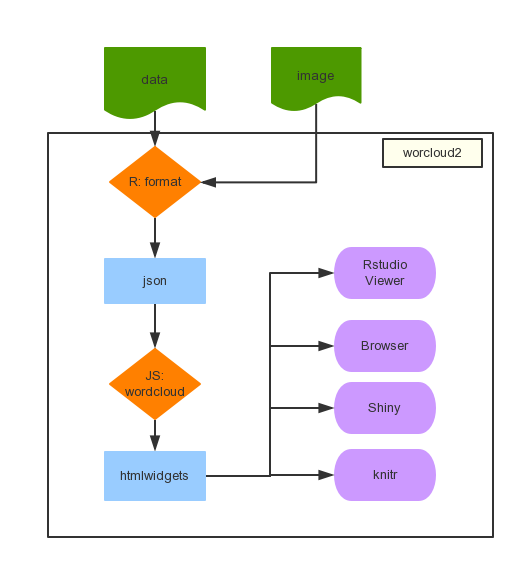
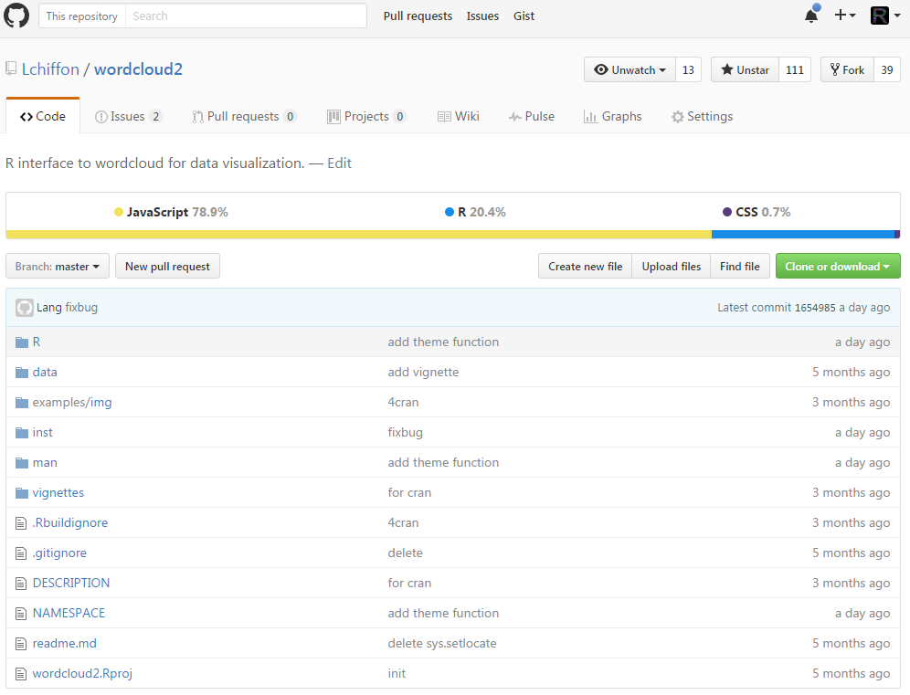
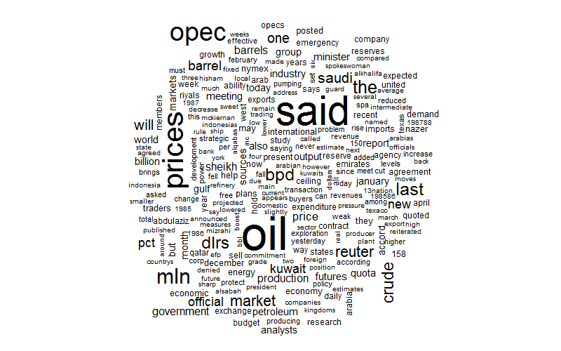
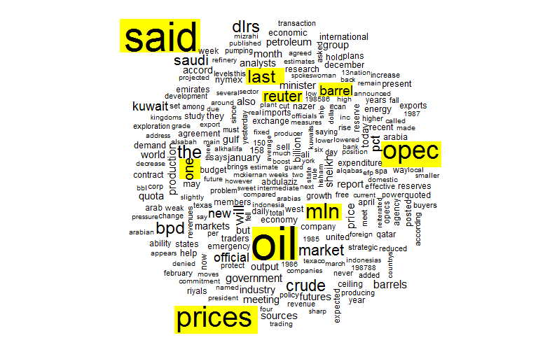
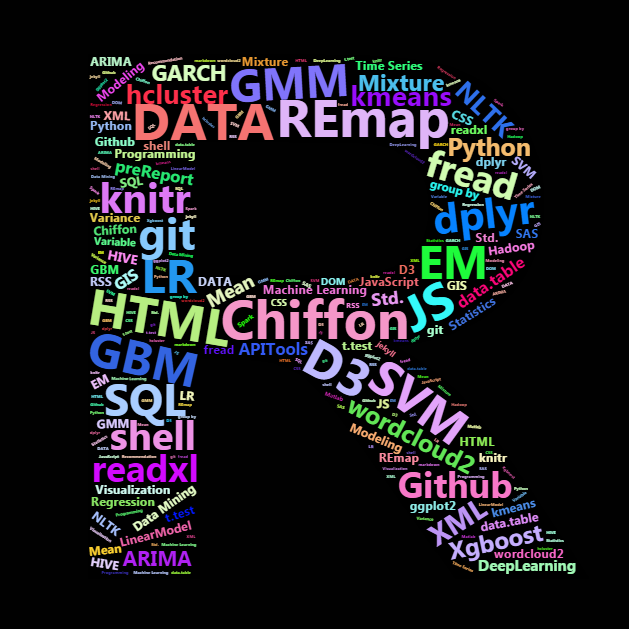
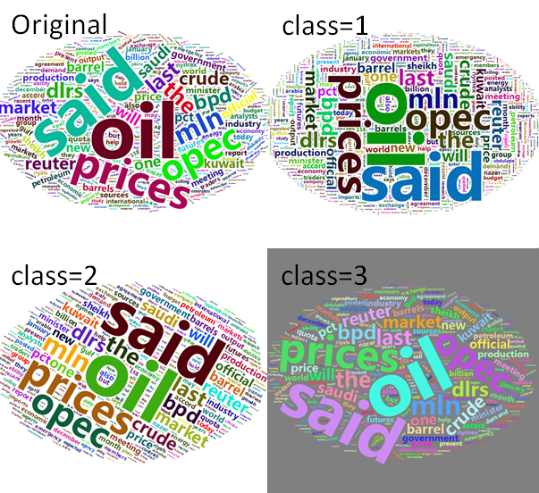
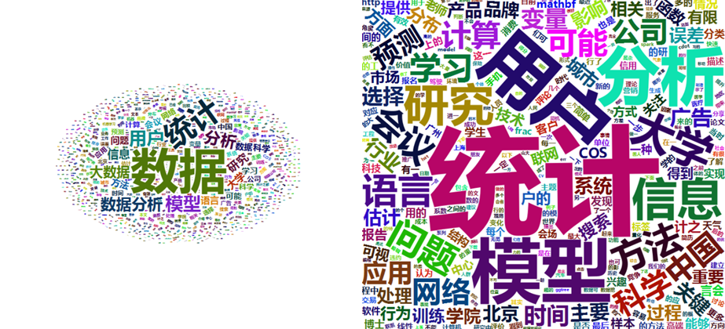

<style>
td{
font-size: 3
}
.title-slide {
  background-color: #e2e2e2;
}

.title-slide hgroup > h1{
  font-family: 'Oswald', '微软雅黑';
  color: #202020;
}

.title-slide hgroup > h2{
  font-family: 'Signika Negative', 'Calibri', '微软雅黑';
  color: #202020;
}

.reveal {font-family: 'Signika Negative', 'Calibri', '微软雅黑';
  color: #202020;
}

strong{
 color: #4876FF;
}
</style>

##  新版词云
### 基于htmlWidgets的wordcloud2
<small> Created by [Chiffon](http://lchiffon.github.io)郎大为</small><br/>
<small>J.D. Power 数据分析师</small>
<script src="./libraries/jquery.min.js"></script>
<script>
			document.write( '<link rel="stylesheet" href="libraries/frameworks/revealjs/css/print/' + ( window.location.search.match( /print-pdf/gi ) ? 'pdf' : 'paper' ) + '.css" type="text/css" media="print">' );
		</script>


---&vertical
## 绘图: 从静态到动态
- 除了统计计算,机器学习以外
- R最出名的莫过于数据可视化
- 翘楚:
  - `lattice`
  - `ggplot2`
  - `corr`
  - `map`
  - ...


***
# JavaScript
## 更适合可视化的语言
- Echarts
- D3
- Highcharts
- ...

***
## htmlwidgets
### 连接R与JS可视化的桥梁
- Rstudio 出品
- 良好的框架
- 方便的输出

***
## htmlwidgets
### 连接R与JS可视化的桥梁
- 良好的框架
  - 配置文件(叙述如何配置HtmlWidgets)
  - JS库(源生JS)


***
# htmlwidgets
## 连接R与JS可视化的桥梁
- 方便的输出
  - Rstudio
  - 浏览器
  - shiny
  - knitr/slidify

***
## [htmlWidgets Gallery](http://gallery.htmlwidgets.org/)


***
## _wordlcoud2_ 流程图


---&vertical
## 安装
- CRAN版:

```r
install.packages("wordcloud2")
```
- 开发版:

```r
devtools::install_github("lchiffon/wordcloud2")
```


***


---&vertical
## 原始wordcloud

```r
library(wordcloud)
wordcloud(demoFreq[,1],demoFreq[,2])
```

<div class="rimage center"></div>

***
- 过大的margin
  - 导致图案过小
- 图案的设置
  - 不能自定义形状


***
## 原始wordcloud



---&vertical
## 基本使用

```r
library(wordcloud2)
wordcloud2(demoFreq)
```

<div class="rimage center"></div>

***
<iframe src="pic/wc1.html" height="600px" width="800px"></iframe>

---&vertical
## 基于图片的 _Wordcloud2_

```r
figPath = system.file("examples/t.png",package = "wordcloud2")
wordcloud2(demoFreq, 
           figPath = figPath,
           size = 1.5, 
           color = "skyblue")
```

***


***


@微信: wetalkdata

---&vertical
## 基于文字的 _Wordcloud2_

```r
library(wordcloud2)
letterCloud(dat,"R", 
            color = "random-light",
            backgroundColor = "black",
            size = 0.3)
```

***


***


[亚磊的博客](http://yalei.name/2016/06/wordcloud2)


---&vertical
## _Wordcloud2_ 主题
- _仅在开发版中使用(2016/10)_

```r
wc = wordcloud2(demoFreq,
                fontFamily='微软雅黑')
wc + WCtheme(class = 1)
## class: 1,2,3
```


***
## _Wordcloud2_ 主题


---&vertical
## _Wordcloud2_ 细节调整

可用参数:
  - size
  - fontFamily
  - color/backgroundColor
  - minRotation/maxRotation
  - rotateRatio
  - shape
  - figPath
  - hoverFunction

***
参数名 | 含义 | 取值
---|---|---
size | 大小 | 1为默认值
fontFamily | 字体 | 'Segoe UI'
color | 颜色 | 'random-dark'
backgroundColor | 背景色 | 'white'
minRotation | 最小角度 | -pi/4
maxRotation | 最大角度 | pi/4
rotateRatio | 旋转比例 | 0.4
shape | 形状 | 'circle'
figPath | 图像 | 图片路径
hoverFunction | JS函数 | 动态函数

***
## _size_

```r
wordcloud2(demoFreqC,size = 0.5,
           fontFamily = '微软雅黑')
wordcloud2(demoFreqC,size = 2,
           fontFamily = '微软雅黑')
```

***



***
## _Wordcloud2_ 主题


***
- theme1: 
  - minRotation = -pi/2
  - maxRotation = -pi/2
- theme2:
  - minRotation = -pi/6
  - maxRotation = -pi/6
  - rotateRatio = 1
- theme3:
  - color = "random-light"
  - backgroundColor = "grey"


---
## 图片保存
1. Rstudio Export
2. `webshot` packages


```r
install.packages("webshot")
webshot::install_phantomjs()
library(wordcloud2)
hw = wordcloud2(demoFreq,size = 3)
saveWidget(hw,"demo.html",selfcontained = F)
webshot::webshot("demo.html","demo.png",
                 vwidth = 800, vheight = 600, delay =3)
```


---&vertical
## _shiny_

```r
wordcloud2Output(outputId, width = "100%", height = "400px")
renderWordcloud2(expr, env = parent.frame(), quoted = FALSE)
```

***
## _knitr/slidify_

```r
install.packages("webshot")
webshot::install_phantomjs()
```

***
## 中文支持

```r
Sys.setlocale("LC_CTYPE", "chs")
```


---
## Thanks
- 微博@郎大为Chiffon

[wordcloud2主页](http://lchiffon.github.com/wordcloud2)
[My Blog: 七风阁](http://lchiffon.github.io)
<script>
$('ul.incremental li').addClass('fragment')
</script>
