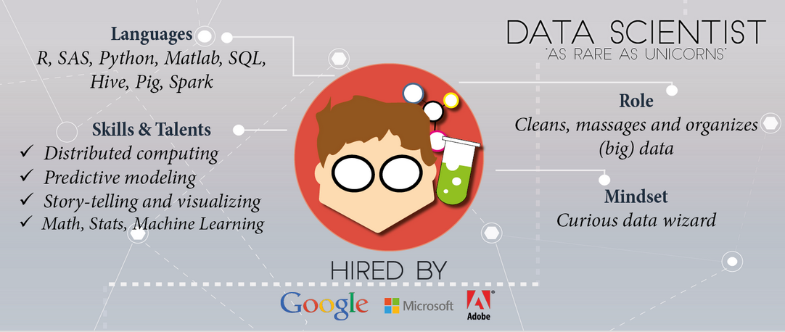

```{r setup, include=FALSE,echo = F, message = F, warning = F, tidy = F}
# make this an external chunk that can be included in any file
options(width = 100,digits=4)
opts_chunk$set(message = FALSE, fig.align = "center", warning = FALSE, comment = NA, dpi = 100, tidy = FALSE, fig.width=8,fig.height=5,cache = FALSE)

options(xtable.type = 'html')
knit_hooks$set(inline = function(x) {
  if(is.numeric(x)) {
    round(x, getOption('digits'))
  } else {
    paste(as.character(x), collapse = ', ')
  }
})
knit_hooks$set(plot = knitr:::hook_plot_html)

```

<style>

.title-slide {
  background-color: #e2e2e2;
}

.title-slide hgroup > h1{
  font-family: 'Oswald', '微软雅黑';
  color: #202020;
}

.title-slide hgroup > h2{
  font-family: 'Signika Negative', 'Calibri', '微软雅黑';
  color: #202020;
}

.reveal {font-family: 'Signika Negative', 'Calibri', '微软雅黑';
  color: #202020;
}

strong{
 color: #4876FF;
}
</style>

## 数据科学的博客
### 从Knitr到Jekyll
<small> Created by [Chiffon](http://chiffon.gitcafe.io)郎大为</small><br/>
<small>Supstat. Inc 数据科学家</small>
<script src="./libraries/jquery.min.js"></script>
<script>
			document.write( '<link rel="stylesheet" href="libraries/frameworks/revealjs/css/print/' + ( window.location.search.match( /print-pdf/gi ) ? 'pdf' : 'paper' ) + '.css" type="text/css" media="print">' );
		</script>


---

<small><datacamp.com></small>

---&twocol
## Road Map
***=left
>- Knitr
>- Git & Github
>- RSS
>- Jekyll

***=right


---&twocol
## Knitr
***=left
- Author: 谢益辉
- 可重复报告
- 论文,博客,报告
- 包含
    - Latex
    - Markdown
    - Html
    - Code(R,Python,Ruby,C,...)
***=right


---

## <a href='pic/rmarkdown-cheatsheet.pdf' target="_blank">R + Markdown</a>

<iframe src="pic/rmarkdown-cheatsheet.pdf" width='100%' height='700px' ></iframe>

---&twocol
## Slidify
***=left
- Author: Ramnath Vaidyanathan
- 用Rmd撰写报告
- 缩减优化格式动画的时间
- 花更多的时间在内容上
- [UseReveal](http://chiffon.gitcafe.io/2015/05/08/RevealJS.html)
***=right


---
## Rpubs


---&twocol
## Git 
***=left

- 版本管理工具
- Git三板斧:
  - add
  - commit
  - push

***=right


---&twocol
## Github
***=left
- 多人代码协作
- 以Git为基础
- 最新,最高端的开源项目
  - Spark, Hadoop, Docker,..

***=right


---
## Example
- [REmap](https://github.com/lchiffon/REmap)


---
## 阅读别人的博客
### RSS
- 统一规范的订阅(比如feed.xml)
- 可以使用邮件/App来完成订阅
- 听别人讲故事
- 了解最前沿的技术发展潮流

---
## 了解前沿
- 查询我订阅文章中的Deeplearning


---&twocol
## 构建自己的博客
***=left
- [Jekyll](http://jekyll.bootcss.com/)
  - 用Knitr撰写文章
  - 用Jekyll生成静态网页
  - 使用github部署到网络
***=right


---


---&twocol
## Jekyll

***=left
### 优点
- 免费
- 其他Blogger的各种不同的模板


***=right
### 缺点
- 上手稍复杂
- github有可能跪(gitcafe.com)


---
## [七风阁](http://lchiffon.github.com/)


---
## [REmap主页](http://lchiffon.github.com/REmap)


--- &vertical
## 进一步个性化


***


***


---
## 收获&建议
>- 不断学习的状态
>- 前端的能力
  - H5,REmap
>- 跟上数据科学的浪潮
>- 不仅与数据打交道

---


---
## [雪晴数据网](http://xueqing.cc)


---
## Thanks
- 微博@郎大为Chiffon

[REmap主页](http://lchiffon.github.com/REmap)
[My Blog: 七风阁](http://lchiffon.github.io)
<script>
$('ul.incremental li').addClass('fragment')
</script>