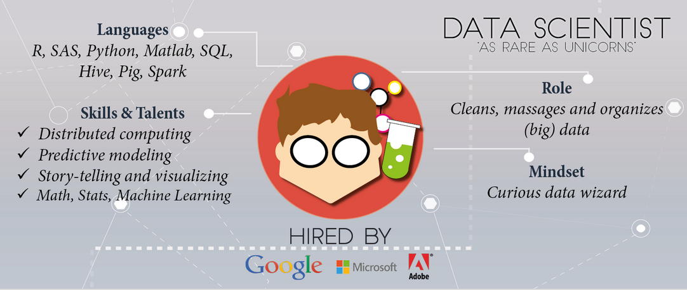
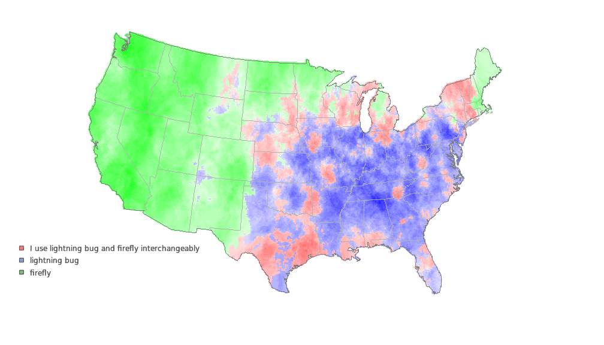

```{r setup, include=FALSE,echo = F, message = F, warning = F, tidy = F}
# make this an external chunk that can be included in any file
options(width = 100,digits=4)
opts_chunk$set(message = FALSE, fig.align = "center", warning = FALSE, comment = NA, dpi = 100, tidy = FALSE, fig.width=8,fig.height=5,cache = FALSE)

options(xtable.type = 'html')
knit_hooks$set(inline = function(x) {
  if(is.numeric(x)) {
    round(x, getOption('digits'))
  } else {
    paste(as.character(x), collapse = ', ')
  }
})
knit_hooks$set(plot = knitr:::hook_plot_html)

```

<style>

.title-slide {
  background-color: #e2e2e2;
}

.title-slide hgroup > h1{
  font-family: 'Oswald', '微软雅黑';
  color: #202020;
}

.title-slide hgroup > h2{
  font-family: 'Signika Negative', 'Calibri', '微软雅黑';
  color: #202020;
}

.reveal {font-family: 'Signika Negative', 'Calibri', '微软雅黑';
  color: #202020;
}

strong{
 color: #4876FF;
}
</style>

## 常用R包简介
### Intro to R packages
<small> Created by [Chiffon](http://chiffon.gitcafe.io)郎大为</small><br/>
<small>J.D. POWER 数据分析师</small>
<script src="./libraries/jquery.min.js"></script>
<script>
			document.write( '<link rel="stylesheet" href="libraries/frameworks/revealjs/css/print/' + ( window.location.search.match( /print-pdf/gi ) ? 'pdf' : 'paper' ) + '.css" type="text/css" media="print">' );
		</script>


---

<small><datacamp.com></small>


---
## Outlines
- 数据处理
- 可视化
- 机器学习
- 开发框架
- 其他


---&vertical
## 数据处理

***
## plyr
- colwise

***
## dplyr
- [Link](http://www.xueqing.tv/course/31)

***
## data.table
- fread

***
## reshape2
- dcast
- melt

***
## tidyr

***
## RODBC

***
## DBI
- RMySQL
- RSQLite
- RPostgreSQL

***
## 爬虫类
- XML
- rvest
- Rcurl
- Rweibo

***
## 外部数据类
- foreign
- readr
- jsonlite
- xlsx::read.xls

---&vertical
## 可视化(静态)

***
## 基本绘图
- latice
- ggplot2
  - gridExtra
  - ggThemes

***
## ggmaps


***
## 其他绘图
- maps/mapproj
- choroplethr
- corr


---&vertical
## 可视化(动态)
- [htmlwidgets](http://gallery.htmlwidgets.org/)

***
## plotly

***
## DiammeR
- [DiammeR](http://rich-iannone.github.io/DiagrammeR/)

***
## networkD3

***
## DT

***
## leaflet

***
## recharts

***
## REmap

***
## wordcloud2
- ~~wordcoud~~

---&vertical
## 机器学习

***
## Tree-based
- raprt
- C5.0
- GBM
- xgboost

***
## Regression
- glmnet
- car
- ks
- survival

***
## 时间序列
- forecast

***
## 神经网络及DL
- nnet
- mxnet

***
## SVM
- e1071
- kernlab

***
## NLP
- tm
- tmcn
- jiebaR
- stringi
- stringr

***
## 其他
- arules

***
## 框架及相关
- H2o
- pROC
- caret
- rattle


---&vertical
## 其他

***
## 框架及开发
- shiny
- htmlWidgets
- R6
- Rcpp
- V8

***
## openCPU

***
## 文档
- knitr
- slidify
- rmarkdown
- animation

***
## 数据获取
- baidumap
- quantmod
- ~~APItools~~

***
## magrittr
- %>%

***
## 高效计算
- parallel
- doParallel
- foreach
- Matrix

***
## formatR

***
## swirl

***
## [Awesome R](https://github.com/qinwf/awesome-R)

---
## End
- 微博@郎大为Chiffon
- 邮箱 dawei_lang@sina.cn

[My Blog: 七风阁](http://lchiffon.github.io)


---
# Play Data! Enjoy Data!

---


<script>
$('ul.incremental li').addClass('fragment')
</script>
